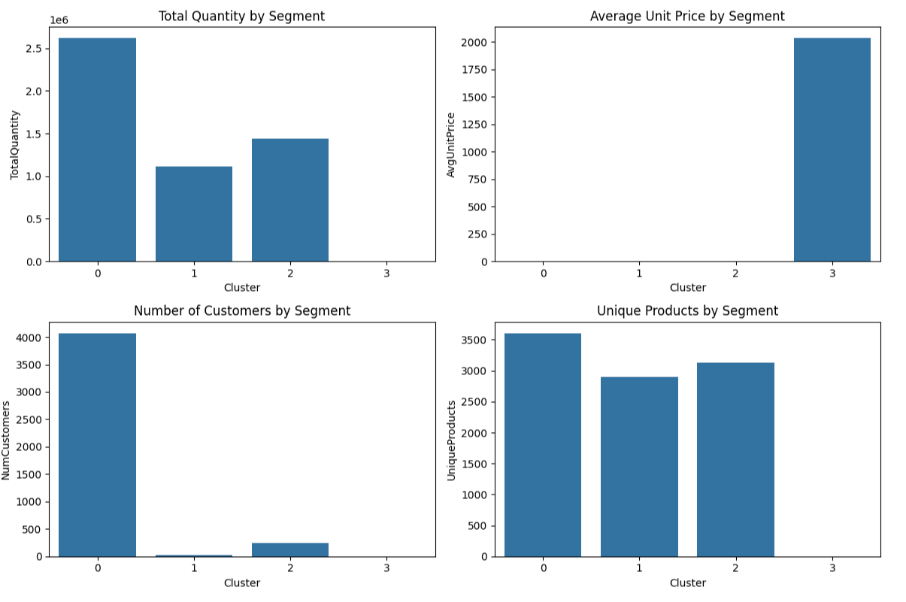
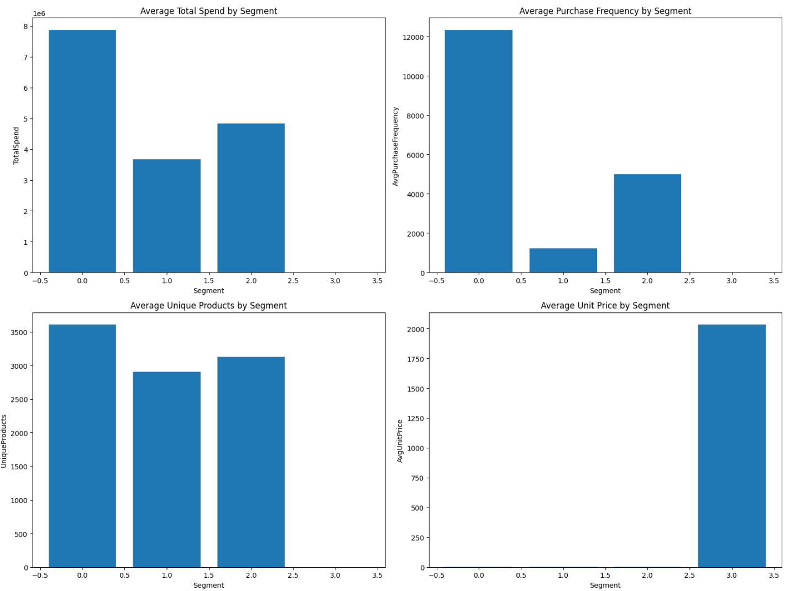
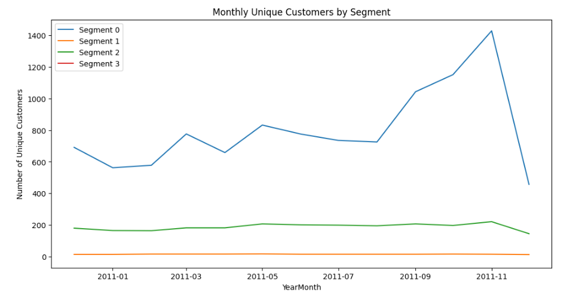
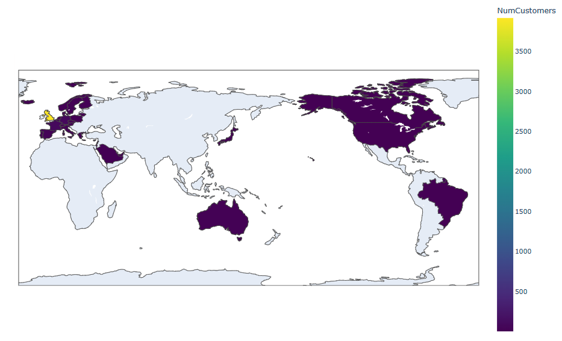

# 📊 Customer Segmentation using K-Means Clustering | (Python)

This project performs customer segmentation analysis on an E-Commerce dataset using K-Means clustering. The goal is to identify distinct customer groups based on their purchase behavior to help businesses design targeted marketing and retention strategies.

---

## 📌 Project Overview

Customer segmentation is a fundamental task in marketing analytics that helps businesses understand their customers better. This project uses transactional data to group customers into segments with similar purchase patterns, frequencies, and spending levels.

---

## 🛠️ Tools Used

| Tool               | Purpose                                          |
|--------------------|-------------------------------------------------|
| **Python**         | Data analysis and modeling                        |
| **Jupyter Notebook** | Interactive development and documentation       |
| **Pandas & NumPy** | Data manipulation and numerical operations       |
| **Scikit-learn**   | K-Means clustering algorithm                      |
| **Matplotlib & Seaborn** | Data visualization and plotting               |

---

## 📋 Methods Applied

- Data cleaning and preprocessing (handling missing values, date conversion)
- Feature engineering (aggregating customer-level metrics)
- Data scaling using StandardScaler for K-Means suitability
- Elbow method for determining the optimal number of clusters
- Applying K-Means clustering to segment customers
- Analyzing segment profiles and visualizing segment characteristics

---

## 🗂️ Repository Structure
- [`customer_segmentation.ipynb`](customer_segmentation.ipynb) : Jupyter Notebook containing the analysis and modeling steps
- [`customer_segmentation.py`](customer_segmentation.py) : Python script version of the notebook for those who prefer running the analysis as a standard Python script in their local environment
- [`README.md`](README.md) : Project description and documentation

---

## 📈 Key Insights

- Customers were successfully segmented into distinct groups with varying purchase frequencies, spending habits, and product preferences.
- Identified high-value customers who contribute significantly to revenue.
- Detected smaller niche and low-activity segments to target with tailored marketing.

---

## 💡 Recommendations

- **Personalized Marketing:** Tailor promotions and communication strategies for each customer segment to maximize engagement and conversion.  
- **Loyalty Programs:** Focus on rewarding high-value segments to boost retention and lifetime value.  
- **Product Assortment Optimization:** Align inventory and offerings with preferences of niche and premium customer segments.  
- **Reactivation Campaigns:** Target low-activity or dormant customers with special offers to increase re-engagement.  
- **Geographic Targeting:** Use regional insights to localize marketing efforts and explore new market opportunities.  
- **Continuous Monitoring:** Regularly update segmentation models and analyze customer behavior to keep strategies effective.  

---

### 📁 Dataset Summary
- E-Commerce Data from [Kaggle - E-Commerce Data](https://www.kaggle.com/datasets/carrie1/ecommerce-data)  
- Approximately 25900 invoice records with 8 features.

---

## 📸 Screenshots

### Customer Segments Overview  

### Segment Behavior Metrics  

### Monthly Purchase Trends by Segment  

### Geographic Distribution of Customers  

---

## 📬 Contact

- **GitHub:** [github.com/seckinozler](https://github.com/seckinozler)  
- **LinkedIn:** [linkedin.com/in/seckinozler](https://www.linkedin.com/in/seckinozler/)  
- **Website:** [seckinsafakozler.wixsite.com/portfolio](https://seckinsafakozler.wixsite.com/portfolio)

---

